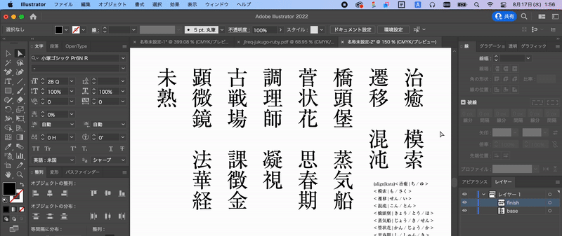

# illustrator-ruby

Adobe Illustrator 上でルビ（振りがな）を振るためのスクリプトです。

Illustrator は標準でルビ機能に対応していませんが、本スクリプトを用いることでルビのサイズや揃え位置、進入の有無、熟語ルビといった高度な指定を交えながら、ルビ処理を一括で行うことができます。

**illustrator-ruby** - an Adobe Illustrator script for ruby function.
This script implements writing Japanese ruby characters automatically, which Illustrator does not support as standard, with advanced specifications such as ruby size, alignment, penetration, and jukugo-ruby.



[解説記事](https://zenn.dev/inaniwaudon/articles/e7c11633685cf5) - スクリプトの使用方法や、ルビの基本に関して解説しています。

[サンプル](./docs/sample.md) - [詳細設定](./docs/attribute.md) - [FAQ](./docs/faq.md) - [Contribution](./docs/CONTRIBUTING.md)

## 主な特徴
- モノルビ・熟語ルビ（[JLReq](https://www.w3.org/TR/jlreq/) に準拠）・グループルビに対応しています。
- ポイント文字、エリア内文字、パス上文字に対して、縦組・横組いずれの場合もルビを振ることができます。
- パス上文字の場合、ルビは水平方向（縦組の場合は垂直方向）に配置されます。パスに沿ってルビが回転することはありません。
- スレッドテキストには対応していません。
- ルビは親文字のテキストフレームとは別に新たなポイント文字として配置され、グループ化された状態で生成されます。
- Adobe Illustrator 2022 (26.3.1) で動作確認をしています。

## 使用方法
### ルビの記述
- `[親文字|ルビ]`：グループルビとして扱います。
- `[親文字|ルビ1/ルビ2/...]`：モノルビとして `ルビ1` が親文字の 1 文字目に対応します。
- `<親文字|ルビ1/ルビ2/...>`：熟語ルビとして `ルビ1` が親文字の 1 文字目に対応します。
  - スラッシュで区切られたルビの数は、親文字の文字数と一致する必要があります。
  - 親文字のサイズは統一されている必要があります。また、ルビのサイズは親文字の 1/2 になります。
- `[親文字|上側ルビ|下側ルビ]`：上側・下側の両サイドにルビを付与します。

```
# モノルビ（2つの処理結果は同一）
[西|にし][中|なか][島|じま][南|みなみ][方|かた]
[西中島南方|にし/なか/じま/みなみ/かた]

# グループルビ
[筑波大学|つくばだいがく][情報学群|じょうほうがくぐん]

# 熟語ルビ
<越中島|えっ/ちゅう/じま>
<思春期|し/しゅん/き>の<影響力|えい/きょう/りょく>は計り知れない

# 上下にルビを振る
[超電磁砲|レールガン|ちょう/でん/じ/ほう]
[彼女|かのじょ|ヒロイン]
```

### 詳細設定
- ルビのスタイル（揃え位置・サイズ・フォント等）に関して詳細設定を行います。
- `(プロパティ|値)` の形で指定します。  
- 指定可能なプロパティに関しては、[詳細設定](./docs/attribute.md) をご参照ください。

### スクリプトの入手・実行
[Releases](https://github.com/inaniwaudon/illustrator-ruby/releases) から `ruby.jsx` をダウンロードしてください。

Illustrator では、以下の方法でスクリプトを実行できます。
- ファイル → スクリプト → その他スクリプト から `ruby.jsx` を選択する。
- 以下のディレクトリに `ruby.jsx` を配置し、ファイル → スクリプト から実行する。
  - Mac: `/Applications/Adobe Illustrator CC xxxx/Presets/ja_JP/スクリプト`
  - Windows: `C:\Program Files\Adobe\Adobe Illustrator CC 2020\Presets\Scripts`
- `ruby.jsx` ファイルをワークスペース内にドラッグ・アンド・ドロップする。

### ルビの付与
1. ルビを振るテキストを用意し、オブジェクト名を `base` を含む名称にリネームします。
2. もう一つテキストを作成し、1. の内容をコピーします（スタイルは同一でなくても構いません）。オブジェクト名は `finish` を含む名称にリネームします。
3. (2) で作成したテキストに対して、先述した記法を用いてルビや詳細設定を記述します。
6. (1), (2) で作成した 2 つのテキストフレームを選択します。
7. Illustrator 上で `ruby.jsx` を実行します。

## License
Copyright (c) 2022 いなにわうどん.
This software is released under the MIT License, see [LICENSE](./LICENSE).

- MIT ライセンスに従って、自由に使用・再配布等を行うことができます。
- 本スクリプトは無保証です。本スクリプトの仕様を原因とする損失や損害に関して、一切の責任を負いかねます。
